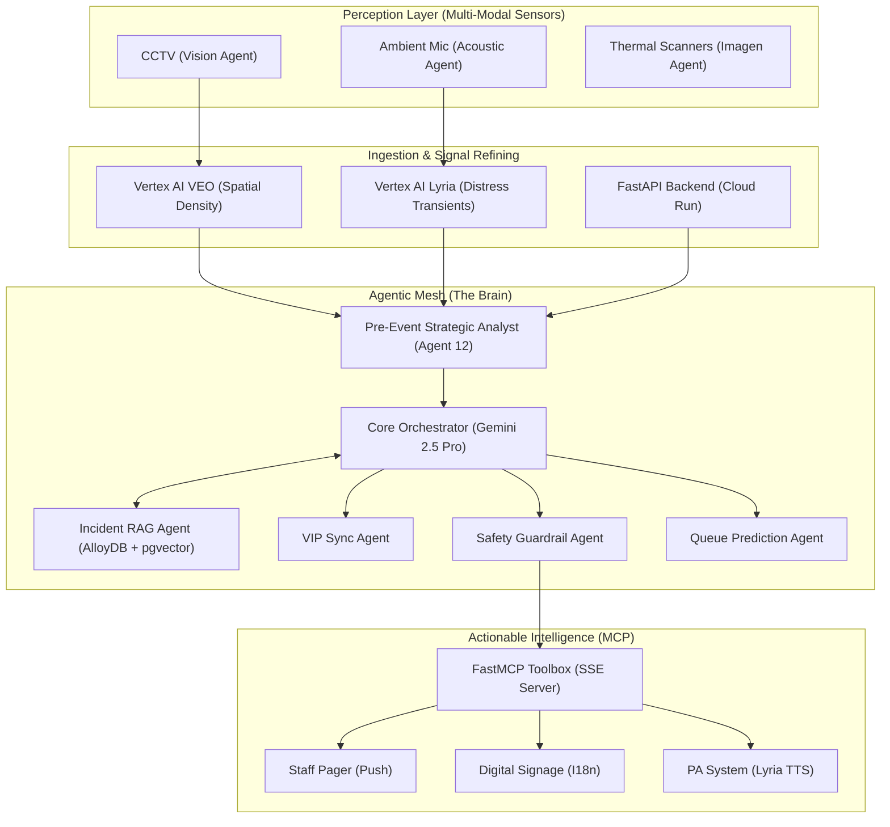

# SpectaSyncAI: Agentic Signal Mesh Architecture (v1.0.0)

SpectaSyncAI leverages a decentralized, tiered intelligence model to coordinate crowd safety across multi-modal sensor inputs. The system transitions from raw telemetry to autonomous agentic reasoning using Google’s most advanced Gemini models.

## 🟢 High-Level System Architecture

---

## 🏗️ The Technology Stack

| Layer | Technology | Role |
| :--- | :--- | :--- |
| **LLM / Foundation** | Gemini 2.5 Pro & Flash | Core Reasoning & Multimodal Ingestion |
| **Agentic Framework** | Google ADK & LangGraph | Multi-agent coordination and state management |
| **Vector Database** | AlloyDB Omni + pgvector | High-performance RAG over legacy incident corpora |
| **API Backend** | FastAPI (Python 3.12) | Real-time signal routing and life-lifeline management |
| **Agentic Toolbox** | FastMCP (SSE) | Standardization of bot-to-hardware communication |
| **Forensic Storage** | Google Cloud Storage (GCS) | Centralized hosting for high-fidelity media assets |
| **Frontend UI** | React 18 + Vite + Tailwind | Real-time digital twin and tactical dashboard |
| **Infrastructure** | Google Cloud Run (Serverless) | Auto-scaling deployment with Dockerized services |

---

## 🧠 Core Intelligence Cycles

### 1. Strategic Audit Cycle (Agent 12)
Before the event starts, the **PreEventAnalystAgent** synthesizes reservations, weather, and transit schedules. It identifies "Deadly Combos" (e.g., Heat Wave + Max Capacity) and triggers **Pre-Gate Authorization** tools via MCP, ensuring auxiliary exits are unlocked and signage is pre-positioned.

### 2. Forensic RAG Loop
When a density surge is detected, the **IncidentRAGAgent** performs a vector search in **AlloyDB** to find analogous historical events. It retrieves specific "lessons learned" and injects them into the **Core Orchestrator's** context to generate a high-confidence intervention plan.

### 2. Multi-Modal Fusion
*   **Vision (Gemini VEO):** Identifies "stagnation points" and flow reversals.
*   **Acoustics (Gemini Lyria):** Detects distress transients (screams, panic signatures) before they appear on video.
*   **Action:** The mesh fuses these signals to verify a crisis before escalating to the **Failsafe Agent**.

### 3. Localization & Inclusivity (I18n)
All interventions are processed through our **Command I18n Engine**, delivering mission-critical instructions in **12+ languages** (Hindi, Telugu, Tamil, Japanese, etc.) dynamically based on the detected demographic density.

---

## 🛡️ Security & Governance
*   **PII Masking**: In-flight anonymization of facial and vocal metadata.
*   **Vertex AI Context Caching**: 90% cost reduction for high-frequency agentic turns.
*   **Hardened IAM**: Zero-trust service identity for cross-layer communication.
*   **HITL (Human-in-the-Loop)**: Mandatory bridge for life-critical evacuations.

---
*Document generated for PromptWars 2026 Hackathon Submission - SpectaSyncAI Team.*
